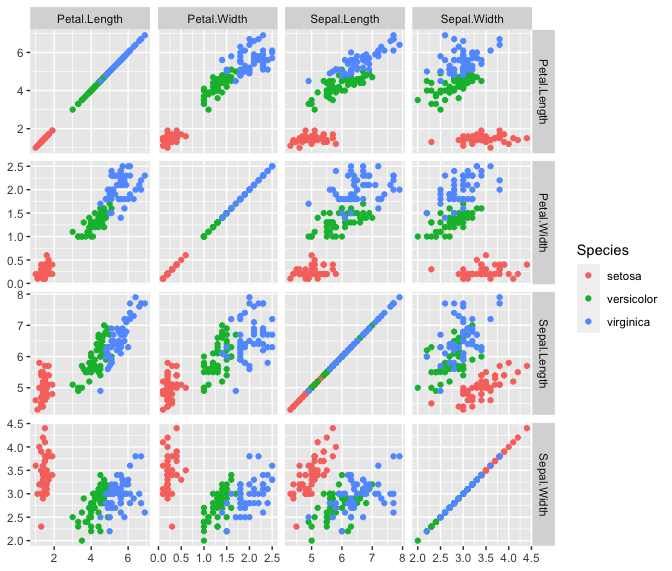

<!-- README.md is generated from README.Rmd. Please edit that file -->

# tidypairs

<!-- badges: start -->
<!-- badges: end -->

This package includes a single function, `tidypairs`, that restructures
a data frame so that it can be used to create a scatterplot matrix with
`ggplot2`.

You can install tidypairs from GitHub like so:
`devtools::install_github("matthewkling/tidypairs")`

## Example

``` r
library(tidypairs)
library(tidyverse)

d <- tidypairs(iris, 
               xy_vars = names(iris)[1:4], 
               z_vars = names(iris)[5],
               mirror = T, diagonal = T)

ggplot(d, aes(x_value, y_value, color = Species)) +
      facet_grid(y_var ~ x_var, scales = "free") +
      geom_point() +
      theme(axis.title = element_blank())
```



<!-- note: use `devtools::build_readme()` to render readme.md -->
